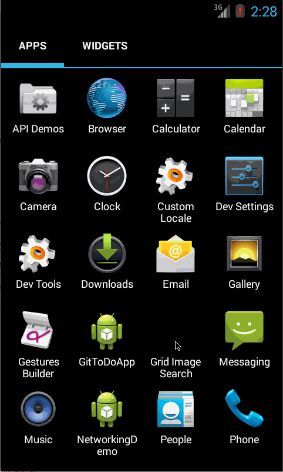
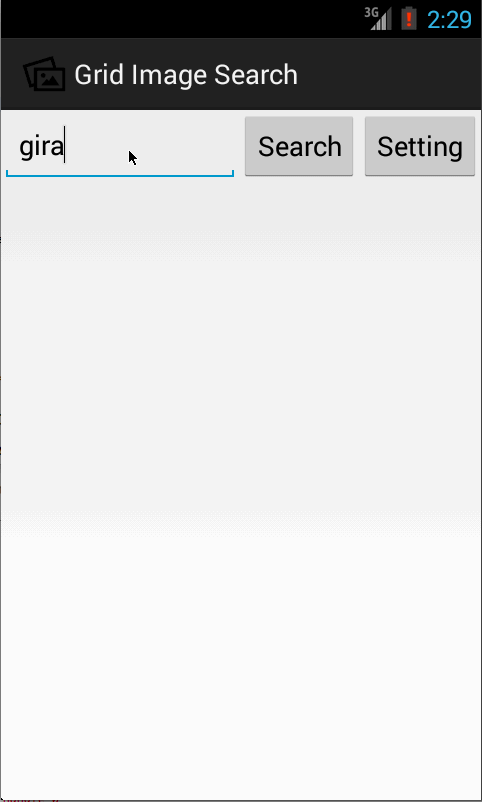

# Grid Image Search

Time spent: 9 hours spent in total

Completed user stories:
 * [x] User can enter a search query that will display a grid of image results from the Google Image API.
 * [x] User can click on "settings" which allows selection of advanced search options to filter results
 * [x] User can configure advanced search filters such as: Size, Type, Color and Site
 * [x] Subsequent searches will have any filters applied to the search results
 * [x] User can tap on any image in results to see the image full-screen
 * [x] User can scroll down “infinitely” to continue loading more image results (up to 8 pages)

Walkthrough of all user stories:
- Setting - change color filter

- Infinite scrolling

- Full image

GIF created with [LiceCap](http://www.cockos.com/licecap/).
